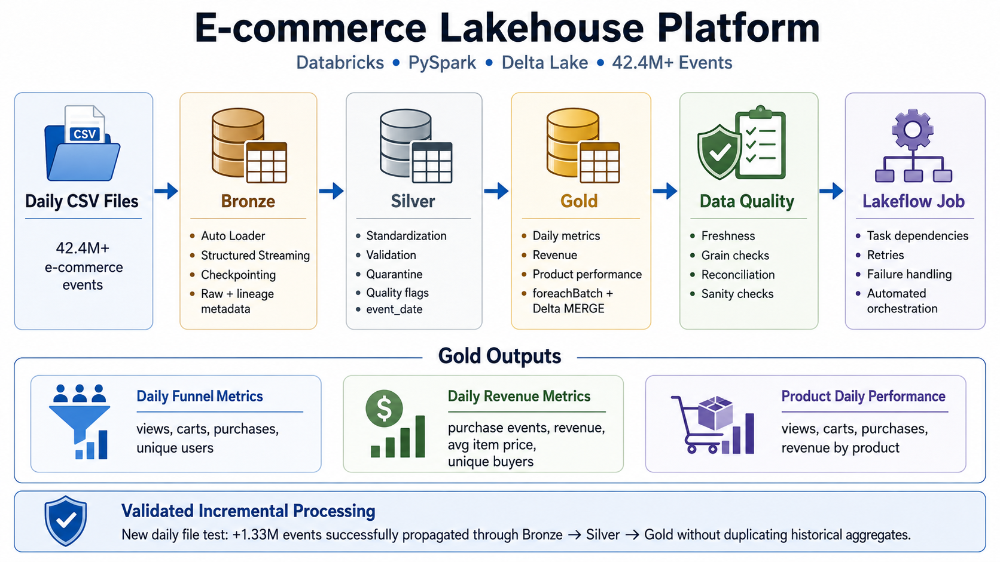
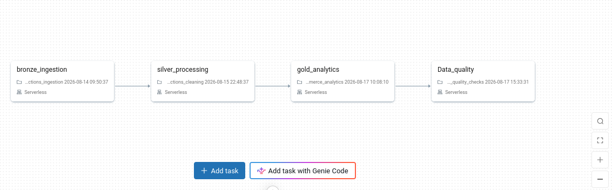
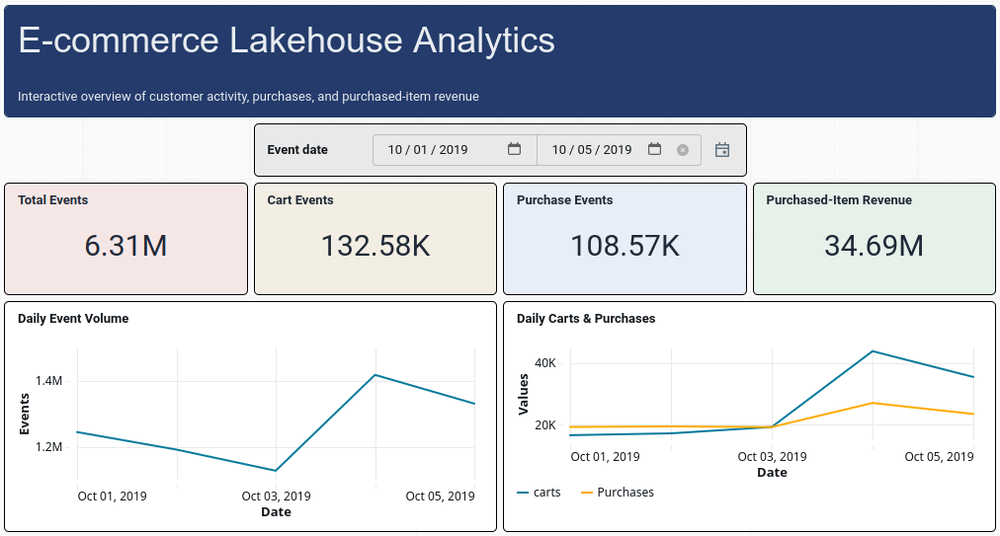

# E-commerce Lakehouse Platform

Production-style **Databricks lakehouse processing 42.4M+ e-commerce events** with PySpark, Delta Lake, Auto Loader, Structured Streaming, incremental Gold upserts, automated data-quality checks, Lakeflow Jobs orchestration, and a Databricks AI/BI analytics dashboard.



## Key Results

- Processed **42.4M+ e-commerce events**
- Built an incremental **Bronze → Silver → Gold** medallion pipeline
- Used **Databricks Auto Loader + Structured Streaming** for daily file ingestion
- Implemented checkpoint-based incremental processing across Bronze, Silver, and Gold
- Built 3 business-ready Gold datasets with explicit table grains
- Used **`foreachBatch` + Delta `MERGE`** for incremental Gold updates
- Recomputed only affected dates to support late-arriving data and exact distinct metrics
- Added Silver validation, quarantine, lineage metadata, and business-aware quality flags
- Added automated freshness, grain, sanity, and Silver-to-Gold reconciliation checks
- Orchestrated the workflow as a 4-task **Lakeflow Job**
- Built a **Databricks AI/BI Dashboard** on curated Gold tables for event, purchase, revenue, customer-activity, and product-performance analytics
- Validated incremental behavior with a **1.33M-event daily batch** without duplicating historical Gold records

## Architecture

```text
Daily CSV Files
      ↓
Databricks Volume
      ↓
Auto Loader + Structured Streaming
      ↓
Bronze
Raw events + lineage metadata
      ↓
Silver
Standardization + validation + quarantine + quality flags
      ↓
Gold
Business-ready incremental aggregates
      ↓
Data Quality
Freshness + grain + reconciliation + sanity checks
      ↓
Lakeflow Job
Dependencies + retries + failure propagation
```

## Dataset

The pipeline processes daily e-commerce behavioral event files.

Core source columns:

```text
event_time
event_type
product_id
category_id
category_code
brand
price
user_id
user_session
```

Observed event types:

```text
view
cart
remove_from_cart
purchase
```

The source does not provide a trustworthy unique `event_id`, so potential duplicate-looking events are retained rather than blindly removed.

> Dataset files are intentionally not committed to this repository because of their size. Add the original dataset URL/source here if you want the repository to link directly to it.

## Medallion Layers

### Bronze — Raw Incremental Ingestion

Notebook: [`01_bronze_transactions_ingestion.ipynb`](notebooks/01_bronze_transactions_ingestion.ipynb)

Bronze uses:

- Databricks Auto Loader
- `cloudFiles`
- PySpark Structured Streaming
- schema inference
- schema rescue
- checkpointing
- Delta Lake

Technical lineage columns:

```text
_ingested_at
_source_file
```

Bronze keeps source events close to their original form so they remain replayable and auditable.

### Silver — Validation & Standardization

Notebook: [`02_silver_transactions_cleaning.ipynb`](notebooks/02_silver_transactions_cleaning.ipynb)

Silver performs:

- event-type normalization
- brand normalization
- required-field validation
- invalid event-type validation
- negative-price validation
- `_rescued_data` validation
- `event_date` derivation
- clean / quarantine split
- quality flags
- Silver processing timestamp

Outputs:

```text
ecommerce_lakehouse.silver.transactions_clean
ecommerce_lakehouse.silver.transactions_quarantine
```

#### Business-aware price quality

Zero-price events are retained with:

```text
_price_quality = ZERO_PRICE
```

rather than automatically rejected. This preserves useful behavioral events while allowing trusted monetary Gold metrics to use only valid prices.

### Gold — Incremental Business Metrics

Notebook: [`03_gold_ecommerce_analytics.ipynb`](notebooks/03_gold_ecommerce_analytics.ipynb)

| Table | Grain | Main Metrics |
|---|---|---|
| `daily_funnel_metrics` | one row per day | views, carts, purchases, users, sessions, event ratios |
| `daily_revenue_metrics` | one row per day | purchase events, revenue, avg purchased-item price, unique buyers |
| `product_daily_performance` | one row per day + product | views, carts, purchases, revenue, unique users |

Gold is not refreshed with blind append.

```text
New Silver rows
      ↓
Identify affected dates
      ↓
Re-read complete Silver data for those dates
      ↓
Recompute exact metrics
      ↓
Delta MERGE
      ↓
UPDATE existing keys / INSERT new keys
```

This supports:

- late-arriving data
- stable Gold table grain
- exact `countDistinct()` metrics
- retry-safe / idempotent final state
- lower compute than full-history recomputation

## Automated Data Quality

Notebook: [`04_data_quality_checks.ipynb`](notebooks/04_data_quality_checks.ipynb)

Checks include:

- Silver / Gold freshness
- non-null Gold keys
- Gold grain uniqueness
- non-negative business metrics
- event-ratio sanity
- Silver-to-Gold purchase reconciliation

If a critical assertion fails, the quality notebook fails and the Lakeflow Job is marked unsuccessful.

## Lakeflow Job

```text
bronze_ingestion
      ↓
silver_processing
      ↓
gold_analytics
      ↓
data_quality_checks
```

The workflow demonstrates task dependencies, retry behavior, failure propagation, and checkpointed incremental execution.

Add a screenshot of the implemented DAG when available:

```md

```


## Databricks AI/BI Dashboard

The curated Gold tables serve an interactive **Databricks AI/BI Dashboard**, keeping the BI layer separated from raw Bronze and Silver data.

Dashboard source tables:

```text
daily_funnel_metrics
daily_revenue_metrics
product_daily_performance
```

The dashboard includes:

- Total Events, Cart Events, Purchase Events, and Purchased-Item Revenue KPIs
- daily event-volume trends
- daily carts vs. purchases
- customer-activity and revenue analysis
- product-performance rankings
- interactive event-date filtering

The dashboard intentionally consumes **Gold** rather than scanning Bronze or Silver, so visualizations use curated business-ready grains and precomputed metrics.



## Incremental Validation

The incremental design was validated by adding a new daily file after the initial pipeline was already populated.

Before:

```text
Bronze: 4,980,066 rows
Silver: 4,980,066 rows
```

After:

```text
Bronze: 6,310,405 rows
Silver: 6,310,405 rows
```

Difference:

```text
+1,330,339 events
```

Gold produced exactly:

```text
2019-10-05 → 1,330,339 total events
```

and preserved one row per day:

```text
2019-10-01 → 1
2019-10-02 → 1
2019-10-03 → 1
2019-10-04 → 1
2019-10-05 → 1
```

This verified Auto Loader incremental discovery, Bronze append behavior, Silver incremental propagation, Gold `MERGE`, and historical grain preservation.

## Project Structure

```text
databricks-ecommerce-lakehouse/
│
├── README.md
├── project-notes.md
│
├── notebooks/
│   ├── 01_bronze_transactions_ingestion.ipynb
│   ├── 02_silver_transactions_cleaning.ipynb
│   ├── 03_gold_ecommerce_analytics.ipynb
│   └── 04_data_quality_checks.ipynb
│
├── assets/
│   ├── lakehouse_architecture.png
│   ├── lakeflow_job_dag.png
│   └── gold_dashboard.png
│
├── .gitignore
└── LICENSE
```

## Technologies

**Databricks · PySpark · Apache Spark · Spark Structured Streaming · Delta Lake · Auto Loader · Lakeflow Jobs · Databricks AI/BI Dashboards · Unity Catalog · SQL · Python**

## Data Engineering Concepts Demonstrated

- Lakehouse / medallion architecture
- incremental ingestion
- Structured Streaming
- Auto Loader
- checkpointing
- Delta Lake
- data lineage
- schema rescue
- data validation and quarantine
- business-aware quality flags
- table grain
- incremental aggregation
- `foreachBatch`
- Delta `MERGE`
- upserts and idempotency
- late-arriving data
- reconciliation and freshness
- workflow orchestration
- retries and failure propagation
- serverless-compute constraints

## Important Engineering Decisions

### Why not blindly deduplicate?

The source lacks a trustworthy unique event identifier. Exact-looking rows may still represent legitimate repeated user actions, so the pipeline avoids unsafe `dropDuplicates()` logic.

### Why recompute affected Gold dates?

Some Gold metrics use `countDistinct()`. Distinct counts from separate micro-batches cannot safely be added because the same user/session may appear in more than one batch.

### Why use `MERGE` instead of append in Gold?

Gold tables have explicit grains. Blind append could create multiple rows for the same day or product/day when late data arrives.

### Why keep zero-price behavioral events?

A bad price attribute does not necessarily make the entire behavioral event useless. Zero-price events are preserved with a quality flag while trusted monetary metrics use valid purchase prices only.

## Production Notes

This project runs on Databricks serverless compute.

Manual Spark DataFrame caching (`cache` / `persist`) was intentionally removed because it is unsupported in this serverless workload.

Development-only inspection cells were removed from the GitHub notebooks. Production validation is handled through automated assertions in the data-quality task.

The Databricks AI/BI Dashboard reads from curated Gold tables rather than Bronze or Silver, keeping transformation logic and analytical consumption cleanly separated.

## Future Enhancements

- alerting / notification refinement
- more advanced observability
- controlled backfill workflow
- additional Gold business metrics where justified by source semantics

## License

This repository uses the **MIT License**.

The source dataset remains subject to its own original license/terms.
